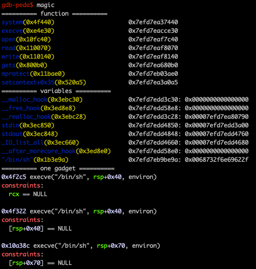

# pwngdb

GDB for pwn.

## TODO

* [x]  magic中加入one_gadget
* [x]  初步完善trace malloc free
* [ ]  heap diff
* [x]  添加新的cmd `xx`，可以根据基址查看内存
* [x]  ra 如果没有指定参数也未使用过，使用当前gdb指定的file

## Install

### Basic
	cd ~
	git clone https://github.com/0xKira/pwngdb.git
	cp ~/pwngdb/.gdbinit ~

If you dont want to use gdb-peda , you can modify the gdbinit to remove it.

### Heapinfo

If you want to use the feature of heapinfo and tracemalloc , you need to install libc debug file (libc6-dbg & libc6-dbg:i386 for debian package) 

## Features

+ `libc` : Print the base address of libc
+ `ld` : Print the base address of ld
+ `codebase` : Print the base of code segment
+ `getheap` : Print the base of heap
+ `tls` : Print the thread local storage address
+ `ra`: Reattach to the process which specify by GDB file
+ `bb`: Break according to the offset to the elf base address
+ `xx`: Examine memory according to the offset to the elf base address
+ `got` : Print the Global Offset Table infomation
+ `dyn` : Print the Dynamic section infomation
+ `findcall` : Find some function call
+ `bcall` : Set the breakpoint at some function call
+ `findsyscall` : Find the syscall (0x050f)
+ `fmtarg` : Calculate the index of format string
  + You need to stop on printf which has vulnerability.
+ `force` : Calculate the nb in the house of force.
+ `heapinfo` : Print some infomation of heap
  + heapinfo (Address of arena)
  + default is the arena of current thread
  + If tcache is enable, it would show infomation of tcache entry
+ `heapinfoall` : Print some infomation of heap (all threads)
+ `arenainfo` : Print some infomation of all arena
+ `chunkinfo`: Print the infomation of chunk
    + chunkinfo (Address of victim)
+ `chunkptr` : Print the infomation of chunk
  + chunkptr (Address of user ptr)
+ `mergeinfo` : Print the infomation of merge
  + mergeinfo (Address of victim)
+ `fastbins` : Print some infomation of fastbin
+ `tracemalloc on` : Trace the malloc and free and detect some error
  + You need to run the process first than `tracemalloc on`, it will record all of the malloc and free.
  + You can set the `DEBUG` in pwngdb.py , than it will print all of the malloc and free infomation such as the screeshot.
+ `parseheap` : Parse heap layout
+ `checkheap`: Show the histroy of one address in heap
    + You need `tracemalloc on` first.
+ `magic` : Print useful variables, functions and one gadget in glibc
+ `fp` : show FILE structure
  + fp (Address of FILE)
+ `fpchain`: show linked list of FILE
+ `orange` : Test `house of orange` condition in the `_IO_flush_lockp`
  + orange (Address of FILE)
  + glibc version <= 2.23

## Screenshot

+ Chunkinfo

  
+ Mergeinfo

  
+ Heapinfo

  
+ Heapinfoall

  

+ parseheap

  

+ tracemalloc

  

+ magic

  

- checkheap

  
